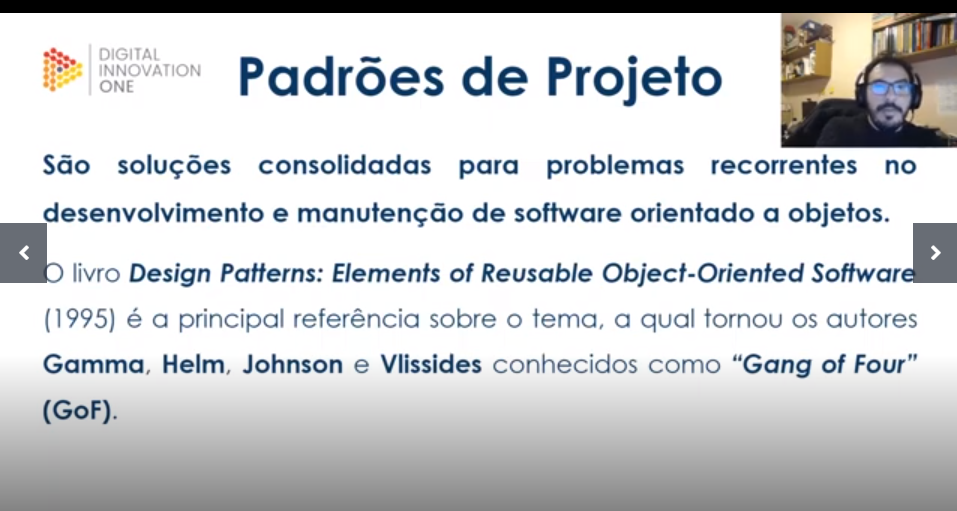
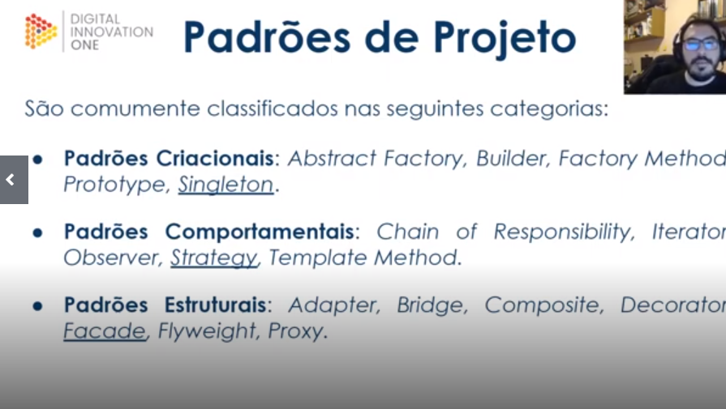
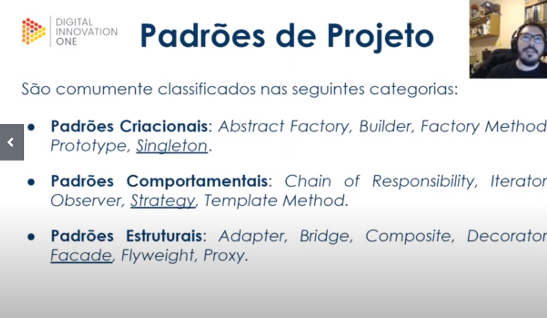

# padroes-proetos-java

Dicas:

Contar os desafios que você superou?
E por que tomou determinadas decisões em seu projeto.

Utilizar o GitHub

Colocar o link do repositório e uma breve descrição, quando for entregar o projeto.

Frase interessante

"Alguém está sentado na sombra hoje porque alguém plantou uma árvore há muito tempo." Warrer Buffet

"Falar é fácil. Mostre-me o código" Linus Trovalds (Criador do núcleo Linux)

# Desafios de projetos.

Imagens para agregar conhecimentos.

# Praticando com Java Puro: Singleton

Singleton 

Permitir a criação de uma única instância de uma classe e fornecer um modo de recuperá-lo.

teste 
te
tttt
tt

